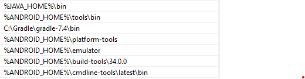

# TODO-LIST

simple todo-list using ionic cordova so it can be compiled to android and ios apps

## Prerequisites

before install the project dependencies make sure you have 
the following programs installed

 * nodejs 18.20.4
 * java JDK 17
 * Android studio
 * Gradle 7.4

Also install the following npm packages

```sh

npm i -g @ionic/cli
npm i -g cordova
npm i -g cordova-res

```

## Install 

Once the prerequisites are installed, you can proceed to install the project dependencies

```
npm install
```

now all the dependencies are installed and the web app can be run with:

```
    ionic serve
```

## Android Setup

Before doing the build make sure you have the next requirements:

```                          
Java JDK: installed 17.0.12
Android SDK: installed true
Android target: installed android-34
Gradle: installed C:\Gradle\gradle-7.4\bin\gradle.BAT
```

and have properly defined the env variables for java and android studio, like this:



now with all configured, you can run the command:

```sh

ionic cordova build android --prod
```

this will generate an optimized build with all the necesary files to run in android, and inside the directory platforms/android will be the project that can be executed inside android studio

it also generates an APK for the project in the route platforms/android/app/build/outputs/apk/debug

## IOS Setup

the project has an initial configuration for ios build but as i don't have acces to MacOs machine or know how to emulate it properly i couldn't make a build to test it, but if you have one an can do the build feel free to do it!

## Questions

1) The most challenging thing was trying to run the project with cordova and that could generate and android project and APK that runs

2) Lazy loading to the pages modules so they are loaded when needed

3) making the code more legible with explicit names for variables and function